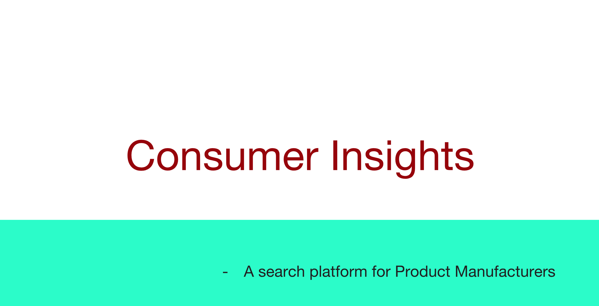
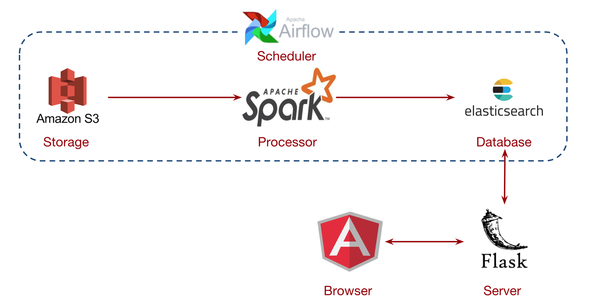

## Motivation
“Not being customer-centric is the biggest threat to any business”

Manufacturers and product designers are often interested in knowing how their product is doing in the market. 
Now a days there are various avenues where they can collect feedback from the Consumers. Converting these large 
datasets into valuable insights has always been the bottleneck. From the customer reviews not only can we understand 
if a customer liked a product or not but also get the specifics of what exactly went wrong and what is that they think
could be improved. This project will help in analyzing and solve some of these problems.

For example, a Product Manager at Bose Speakers would be interested in how their speakers are received in the market 
and what their customers are talking about the speakers.

* What do they like?
* What are they annoyed about?
* What do they expect?
* Did their expectations change over the time?

## Solution
Link to Consumer Insights: [consumerinsights.info:4200](http://consumerinsights.info:4200/)

A search platform for product makers to learn "Consumer Insights"

In the demo, you can observe that while searching for "annoying" most of the people are complaining that the 
speaker is turning off automatically to save power.

## Data
[Amazon Customer Reviews Dataset](https://registry.opendata.aws/amazon-reviews/)
* 17 Years (1999-2015)
* 50 GB
* 9M+ Products
* 20M+ Users
* 130M+ Reviews

## Pipeline

* Initially reviews are stored in an S3 Bucket 
* Spark loads a new batch of reviews after every one hour into memory
* Spark groups reviews by product, computes product analytics such as Product Rating, Total Number of Reviews, Reviews Breakdown 
and stores them in Elasticsearch
* After the arrival of every new batch, the spark job performs insert/update on the 
product depending on its existence in the database 
* Airflow schedules spark jobs to process an year of reviews every 1 hour
* Flask and Angular are used to develop the web application

## Presentation link
Link to the presentation: [Consumer Insights](https://docs.google.com/presentation/d/1Y87Zx1paC_1mu5wxPh92PQM2EvLrC9RXcGUGLQR9pNU/edit?usp=sharing)